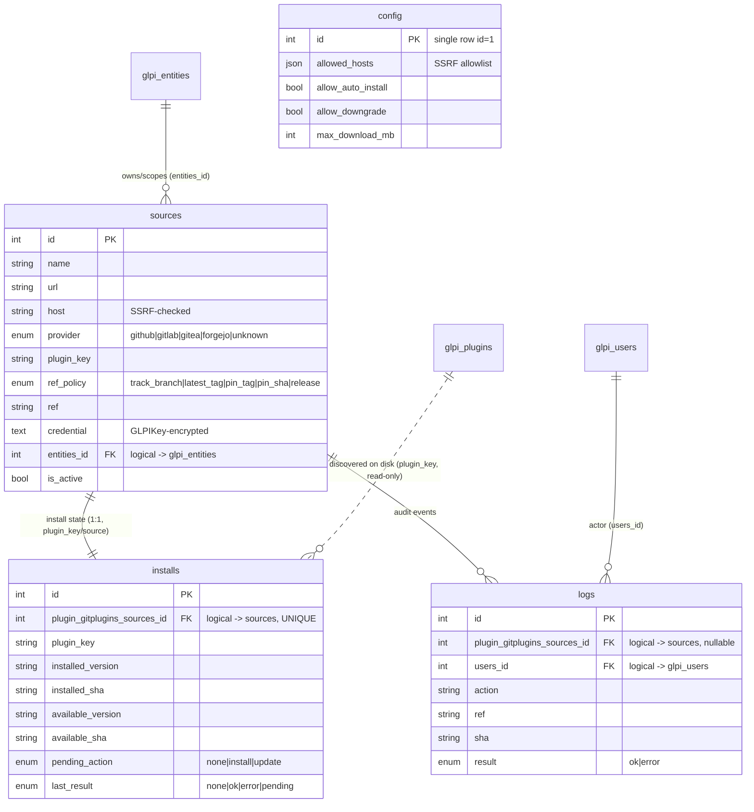

# Git Plugin Installer — Data Model (`gitplugins`)

## Overview

`gitplugins` manages **GLPI plugins sourced from git/HTTPS repositories**: it
records each managed repository and its ref policy, tracks the installed vs.
available version/SHA of every managed plugin, queues install/update actions for
a cron worker, and audits every fetch/install/update. Credentials and the SSRF
host allowlist live in a single-row config.

The schema is four tables, all prefixed `glpi_plugin_gitplugins_`:

- `sources` — a managed repository: URL, detected provider, **ref policy**, and
  a GLPIKey-encrypted credential, entity-scoped.
- `installs` — per managed plugin: installed/available version+SHA and the
  pending action, one row per source.
- `logs` — audit of fetch/install/update actions (generic messages, no secrets).
- `config` — single-row config (SSRF host allowlist, install policy, caps).

**No enforced foreign keys.** As with every GLPI plugin, relationships are
*logical*: `*_id` columns hold the id of a row in another table and the join is
done in code, not via a DB-level FK. `entities_id` points at the GLPI **core**
`glpi_entities` table (read-only scope), and **discovery reads the core
`glpi_plugins` table** to learn what is installed on disk — the plugin never
writes core tables.

## Entity-Relationship Diagram

## Tables

### `glpi_plugin_gitplugins_sources`
**Role.** One row per managed git/HTTPS repository — its normalised URL,
detected forge provider, the **ref policy** that decides which ref to install,
and an encrypted private-repo credential. Entity-scoped for access control.

**Relationships.**
- `entities_id` → `glpi_entities.id` (N:1, owning GLPI entity, with `is_recursive`) [core].
- Referenced by `installs.plugin_gitplugins_sources_id` (1:1 — `UNIQUE` on installs) and by `logs.plugin_gitplugins_sources_id` (1:N).
- `plugin_key` ties the source to a GLPI plugin directory/key, the same key carried in `installs.plugin_key` and discovered in core `glpi_plugins`.

**Notable columns.**
- `provider` ENUM `github|gitlab|gitea|forgejo|unknown` — drives the API/ref-resolution strategy.
- `ref_policy` ENUM `track_branch|latest_tag|pin_tag|pin_sha|release` — how the target ref is resolved (`release` = use the forge's release artifacts); `ref` holds the concrete branch/tag/SHA when not auto-resolved.
- `host` — lower-cased host parsed from the URL, checked against `config.allowed_hosts` (A10 SSRF guard).
- `credential` TEXT — **GLPIKey-encrypted** private-repo token, write-only (never logged/echoed).
- `is_active` — disabled sources are skipped by the update checker.

### `glpi_plugin_gitplugins_installs`
**Role.** Per managed plugin, the install state: what version/SHA is on disk vs.
available from the source, plus the action queued for the cron worker.

**Relationships.**
- `plugin_gitplugins_sources_id` → `sources.id` (1:1, `UNIQUE uniq_source` — one install-state row per source).
- `plugin_key` joins logically to the source's `plugin_key` and to core `glpi_plugins.directory`/key (read-only discovery of what is installed).

**Notable columns.**
- `pending_action` ENUM `none|install|update` — queued action the cron worker applies (indexed).
- `last_result` ENUM `none|ok|error|pending` — outcome of the most recent attempt; `last_error` generic (no secrets).
- `installed_version`/`installed_sha` vs `available_version`/`available_sha`; timestamps `last_check_at`, `last_install_at`.

### `glpi_plugin_gitplugins_logs`
**Role.** Audit log of fetch/install/update actions — generic messages, never
secrets.

**Relationships.**
- `plugin_gitplugins_sources_id` → `sources.id` (N:1, **nullable** — NULL for global events).
- `users_id` → `glpi_users.id` (N:1, the actor, NULL for cron) [core].

**Notable columns.** `action`, `ref`, `sha`, `result` ENUM `ok|error`, `message` (generic, no credentials).

### `glpi_plugin_gitplugins_config`
**Role.** Single-row (id=1) plugin configuration — SSRF host allowlist, install
policy, and download/timeout caps.

**Relationships.** None (standalone singleton).

**Notable columns.**
- `allowed_hosts` JSON — host allowlist for the SSRF-guarded fetcher (A10); seeded with GitHub/GitLab + `git.convergent.tn`, top-up-migrated to add release-download hosts.
- `allow_auto_install` / `allow_downgrade` — install policy gates.
- Caps: `max_download_mb` (1..500), `fetch_timeout_seconds` (5..300), `check_frequency_minutes` (5..40320).

## Relationships summary

- `installs.plugin_gitplugins_sources_id` → `sources.id` (1:1, UNIQUE per source)
- `logs.plugin_gitplugins_sources_id` → `sources.id` (N:1, nullable)
- `installs.plugin_key` ↔ `sources.plugin_key` (logical join by GLPI plugin key)
- `sources.entities_id` → `glpi_entities.id` (N:1) [core]
- `logs.users_id` → `glpi_users.id` (N:1, nullable) [core]
- `installs.plugin_key` / `sources.plugin_key` ↔ `glpi_plugins` (core, read-only discovery of on-disk plugins)
